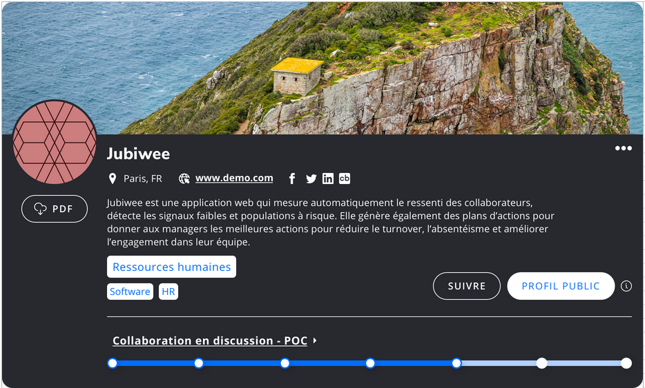

# Technical test for the company Forinov

The goal of this technical test is to make the mockup as closely as possible with a working progress bar but with a few specificity :

- Change the progress at every click and save it
- The date and time of when you clicked it when hovering over it
- The progress
- The state must be saved in a session ( or a cookie) on each click 

